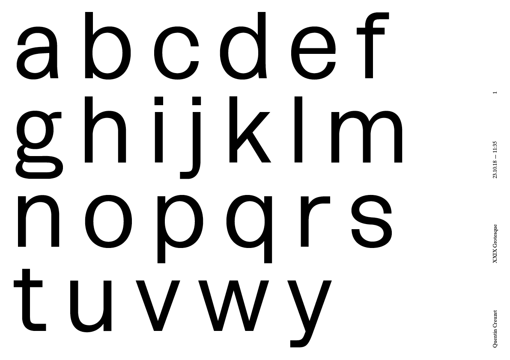
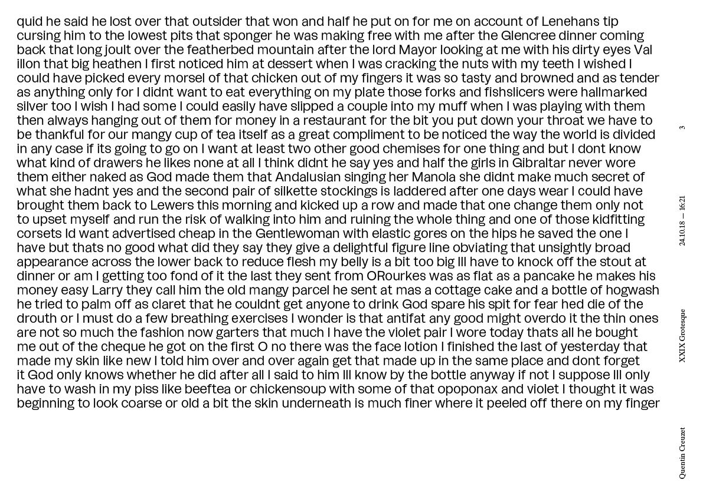

# xxix-grotesque

🔥 A new font for XXIX 🔡

## Work timeline

**10.04.18**

+ Create font file
+ Draw a n o 

**10.08.18**

+ Draw h i j t l

**10.09.18**

+ Draw b d p q

**10.10.18**

+ Draw r s

**10.11.18**

+ Create clean readme.md
+ Clean font folder
+ First reviews
+ Modify t
+ Draw e k f u 

**10.22.18**

+ Draw c g v w

**10.23.18**

+ Draw y
+ Change repo folders
+ Print first pdf
+ Draw x z i.alt j.alt a.alt g.alt
+ Change t and f cross stroke
+ Create dotlessi and components
+ Correct i.alt j.alt and create OT functions
+ Draw E F G H I O Q
+ Correct i and j dots
+ Correct k leg
+ Correct w inner stems
+ Harmonize f j t
+ Correct o
+ Change h, n and m joint
+ Change stroke width
+ Change v w x y z joint
+ Change r curve
+ Change u curve and joint
+ Change a k G Q joints

**10.24.18**

+ Correct a b c d e p q
+ Correct s curves and terminals
+ Correct g ear and upper curves
+ Correct g
+ Correct a.alt i.alt j.alt
+ Delete g.alt
+ Correct g weight and SB
+ Draw A B C K J M P R T U V
+ Correct A width
+ Add ink traps on v w x y
+ Correct G spur
+ Draw period ellipsis comma
+ Draw period.alt ellipsis.alt and update OT functions
+ Change space width
+ Print second pdf

**10.25.18**

+ Change width of some letters
+ Add ink traps on k and K
+ Change I
+ Correct B C G P R
+ Correct f
+ Draw D N S W Z
+ Correct O (and linked) SB 
+ Correct k z K M N ink traps
+ +5 on uppercase SBL and SBR

**11.01.18**

+ Reduce x-height and change vertical metrics
+ Draw a f h i j l n o r t u y

**11.05.18**

+ Draw b d e k m p q s v

**01.14.19**

+ Draw g w H I L N O

**01.16.19**

+ Rework on the main structure

## To do

+ [ ] Basically everything 🙃
